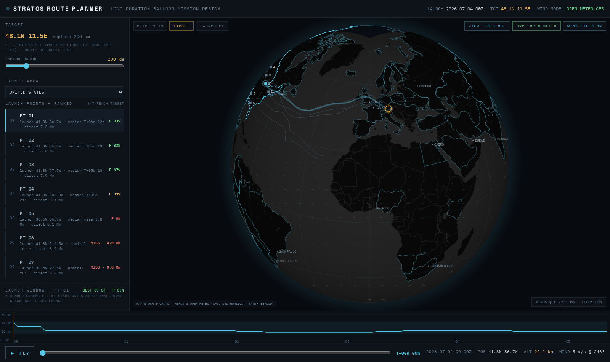

# STRATOS Route Planner

Long-duration balloon mission design — live at **[stratos.häh.ch](https://stratos.häh.ch)**.

Plan stratospheric balloon missions end-to-end: pick a target, rank candidate launch
points, compare altitude-control strategies and scan launch windows — all computed
in the browser against **actual wind forecasts** (Open-Meteo GFS pressure-level data,
14-day horizon), with a synthetic climatology as offline fallback.



## Features

- **3D globe & 2D Mercator ops map** (canvas-rendered, OSM/Carto raster underlay,
  orthographic globe with wind-field overlay at the balloon's current altitude)
- **Live forecast winds** — Open-Meteo GFS at 7 pressure levels (850–50 hPa),
  fetched on startup; toggle back to the simulated climatology any time
- **Physics model** — ISA atmosphere, helium/hydrogen lift, envelope mass,
  float-ceiling bisection, ballast/vent budgets for zero-pressure,
  superpressure and altitude-adjustable balloons
- **Trajectory simulation with altitude steering** — hourly integration picking
  the wind layer that best advances toward the target
- **Launch-point ranking** — samples candidate points in a country or custom
  circular area, ranks by arrival, with 6-member Monte Carlo wind ensembles
- **Launch-window scan** — arrival probability vs. start date, click to set
- **Mission playback** — fly the route with a time scrubber and altitude profile

## Development

```sh
npm install
npm run dev        # dev server
npm test           # unit tests (simulation engine, Vitest)
npm run test:e2e   # e2e tests incl. live-forecast fetch + screenshots (Playwright)
npm run build      # production build to dist/
npm run deploy     # build + deploy to Cloudflare (stratos.häh.ch)
```

CI runs the full test suite on every push; e2e screenshots are uploaded as
workflow artifacts for visual verification.

## Credits

- Winds: [Open-Meteo](https://open-meteo.com/) (GFS)
- Map tiles: © OpenStreetMap contributors, © CARTO
- Country borders: [world.geo.json](https://github.com/johan/world.geo.json)
- Design: built from a [Claude Design](https://claude.ai/design) project
